<p align='left'>
  
</P>

<a id="top"></a>

## `Bloques temáticos:`

- [**Maquetación de formulario**](#item1)
- [**Evento onSubmit**](#item2)
- [**Mantener estado de formulario**](#item3)
- [**Homework**](#item4)

---

---

Llegó el momento de los eventos. Si bien en clase se ve lo mismo, en este tutorial no vamos a ver `Hook Form React`. La razón es porque más adelante vamos a realizar un custom hook con este formulario para poder comparar con `React Hook Form`. Obviamente una librería siempre es más cómoda y rápida, pero nuestra idea también es que tengan otras variantes y formas de llegar a un mismo resultado.

---

---

<a id="item1"></a>

## `Maquetación de formulario`.

Para comenzar voy abrir mi componente `Register.jsx` para armar la maquetación de mi formulario. Este va a estar compuesto por un `div` contenedor, que contendrá un título y la etiqueta `form`, estos los voy a separar con un `hr`.
Dentro del formulario crearé un `div` contenedor que va a tener por un lado el `label` y por el otro un `input`. El input será de tipo text, va a tener un placeholder y la propiedad `name` que será de gran importancia más adelante. Además de este `div` contendor, debajo del mismo voy a crear un button de tipo submit que será el encargado de capturar justamente el submit del formulario.

Así es como viene mi código hasta ahora:

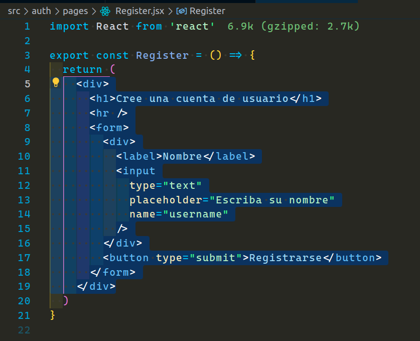

Voy a agregar dos inputs más. Uno será para el email y otro para la contraseña.

El código con esta modificación es el siguiente:

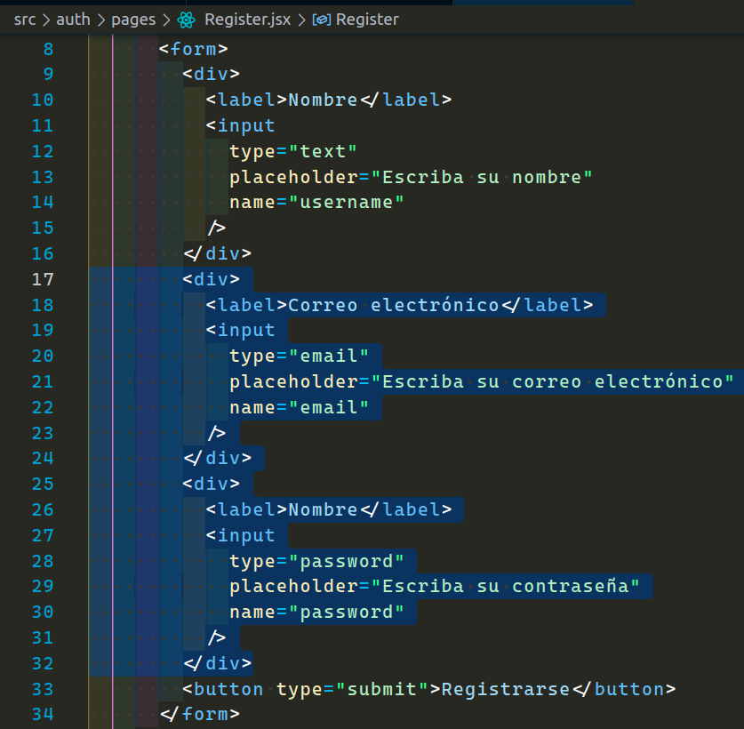

Para ver el resultado en el navegador debemos recordar que no tenemos ningún `Link` que nos lleve a esta ruta, por ende lo haremos manualmente.
En el navegador ingresamos la url de nuestro componente registro que en nuestro caso es el siguiente:

```
http://localhost:3000/registrarse
```

resultado en el navegador:

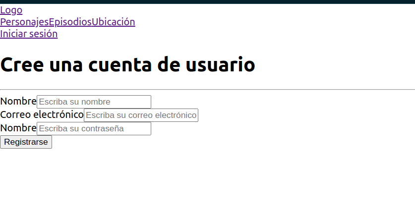

Bueno, ya con esto tendríamos nuestro maquetado terminado. Como podemos notar, vemos que se repite algo de código, por ende, ya podríamos estar pensando en una componetización, pero eso se los dejaré de tarea.

---

---

<a id="item2"></a>

## `Evento onSubmit`.

Mi `button` de type submit es el encargado de ejecutar el evento `onSubmit` de mi formulario. En la apertura de mi etiqueta `form` voy a añadir este evento pasando la función que también voy a estar creando a continuación.

Esta función la voy a declarar con el nombre de `"onFormSumit"`. Como se vio en clases, la naturaleza del evento onSubmit es recargar la página, pero podemos eludir este comportamiento con el `preventDefault` y así poder respetar el comportamiento de una aplicación SPA (Single Page Application), sin necesidad de recargar toda la página.
Debajo del `preventDefault` voy a agregar un `console.log()` para asegurarme que la función esté funcionando.

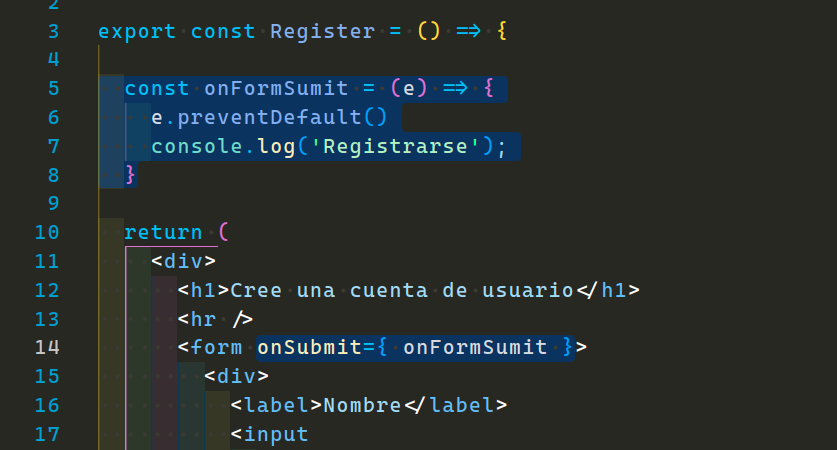

resultado en consola:

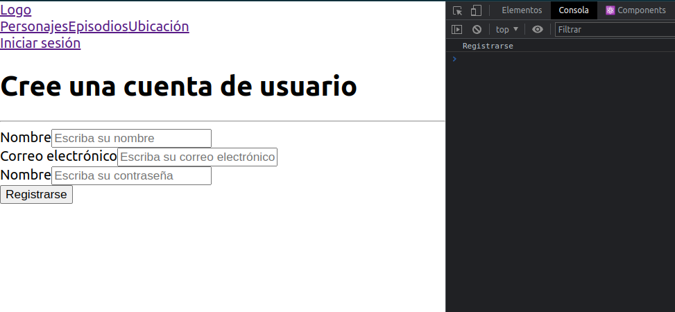

Todo está funcionando correctamente hasta ahora.

[**subir**](#top)

---

<a id="item3"></a>

## `Mantener estado de formulario`.

Para generar mi estado de formulario usaré el hook `useState()`. Lo voy a importar desde react y declarar en la parte superior de mi función. Todos nuestros hooks siempre deben de estar en la parte superior. Como estado inicial le pasaré un objeto con las siguiente propiedades:

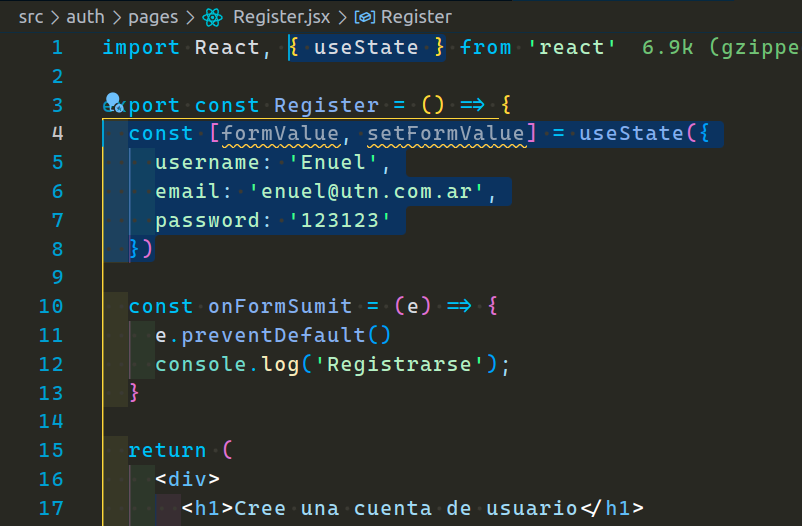

Si ahora ustedes van a las devtools de su navegador podrán notar que ahora tenemos el hook con nuestro estado:

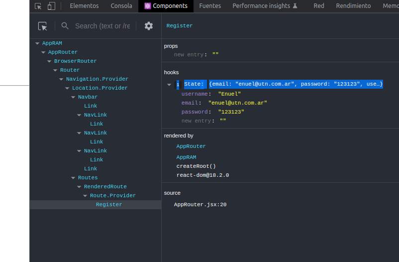

Sino tienen esta extensión en el navegador y les interesa, la podrán encontrar como `"React Developer Tools"`.

Ahora voy a establecer estos valores en mi formulario. Para hacer eso primero voy a desestructurar los mismos desde mi `formValue` y se los voy a pasar a cada input con la propiedad `value`.

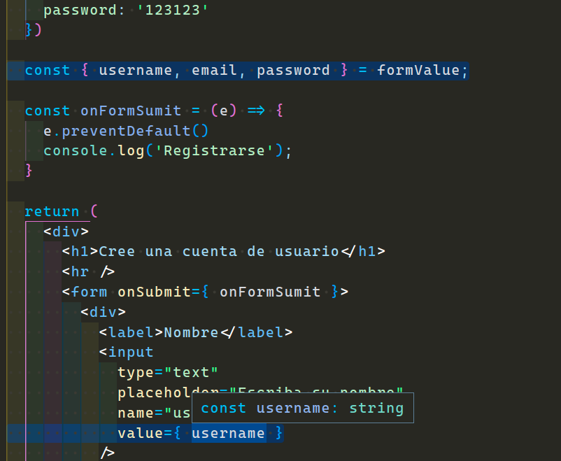

Si vamos a nuestro navegador ya tendríamos que ver los valores en nuestros inputs.

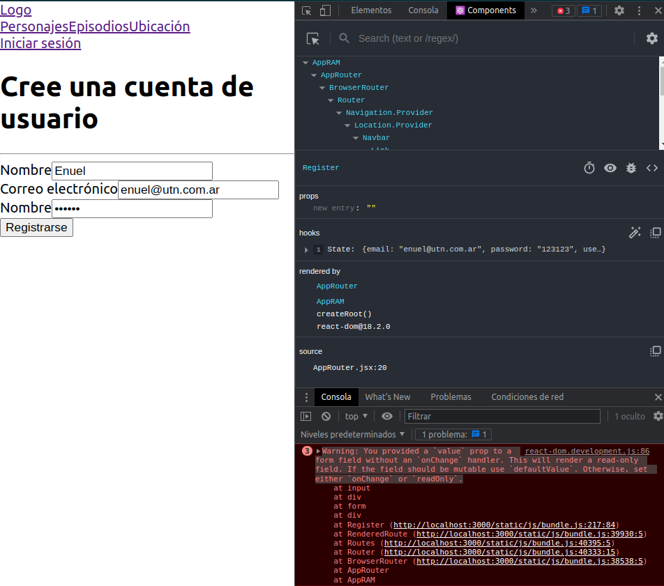

Como pueden comprobar los valores ya están en los inputs, pero también podrán notar que los mismos no se pueden cambiar ya que `React` trabaja en una sola vía.
Si se fijan, en la consola está arrojando un `"Warning"`, el mismo nos da una cierta pista. Nos dice que hemos proporcionado un valor a un campo de formulario sin un manejador `"onChange"`. Esto generará un campo de sólo lectura. Nos dice que debemos establecer el `onChange` o bien el `readOnly`. En nuestro caso, queremos poder modificar este campo, así que procederemos con el onChange.

[**subir**](#top)

---

---

<a id="item3"></a>

## `Evento onChange`.

Voy a crear una función que me permita hacer los cambios de mis inputs, esta función la voy a mandar como referencia en la propiedad `onChange` de cada uno de mis inputs.
El primer argumento que me va a pasar va a ser el evento, por ende, se lo voy a pasar a mi función y voy a hacer un `console.log(event)` para ver qué información obtengo.

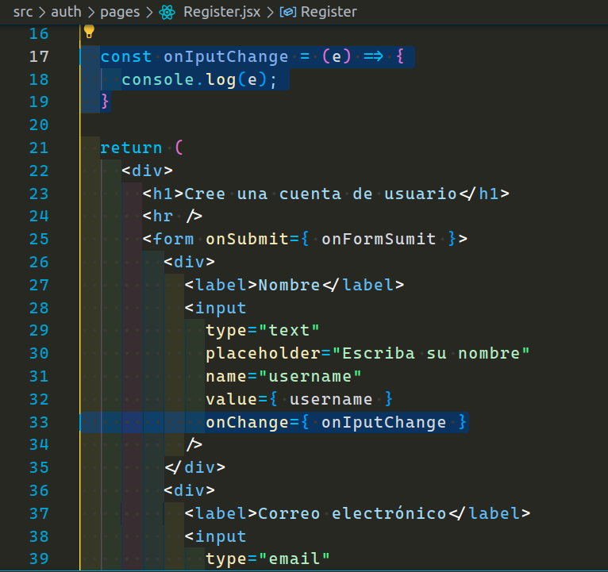

Si vamos a la consola y escribimos cualquier cosa, va a mostrar un montón de información. Si nosotros buscamos entre toda esa información vamos a encontrar el `target` con el valor de nuestro input.

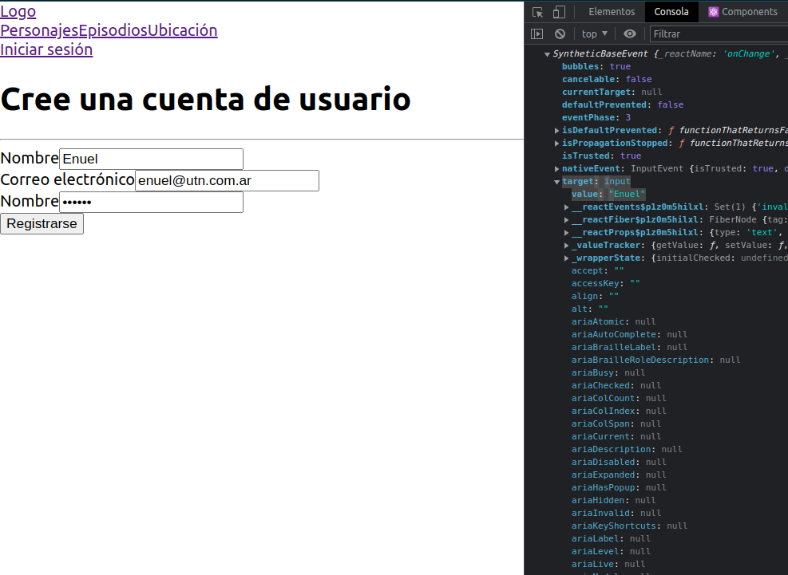

Nosotros en nuestros inputs agregamos la propiedad `name`, ¿Recuerdan que les dije que iba a ser importante?. Bueno, ahora si nosotros en nuestra función hacemos un console.log(e.target.name), podemos ver que nos da la referencia al `name` del input que estamos escribiendo. Entonces con esto ya sabríamos las palabras claves para poder trabajar.

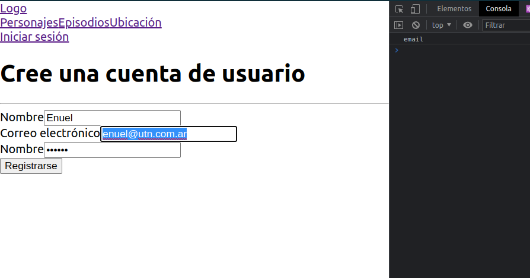

Entonces en mi función voy a desestructurar el target y voy a extraer el name y el value. Para hacer cambio del estado voy a mandar a llamar el `setFormValue` de mi `useState()` y voy a pasarle el objeto, ya que ese es el estado inicial de nuestro useState(). Con el operador spread voy a mantener el estado de todo lo que me llega ya que podrían ser muchas properties, y la que quiero cambiar va a ser la propiedad name, y para esto existe en JavaScript las propiedades computadas de los objetos, entre corchetes le voy a decir que la propiedad `[ name ]` es la que voy a establecer en el objeto con el nuevo valor.

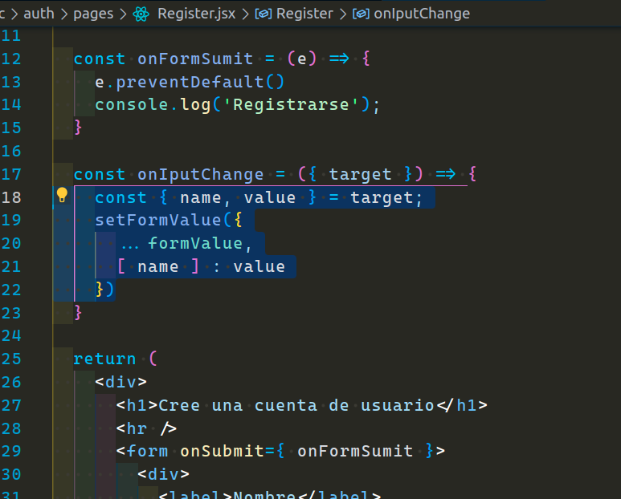

resultado:

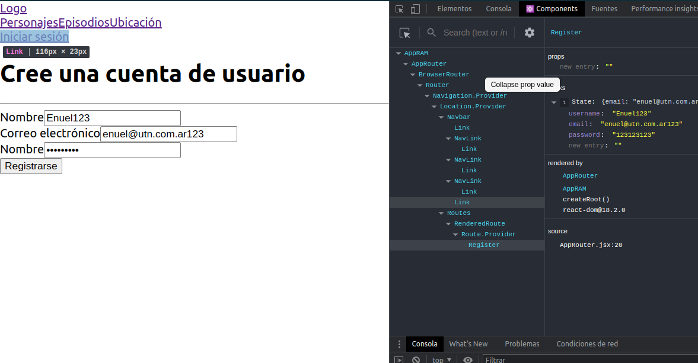

Eso es todo, como pueden ver en la imagen anterior, ya podemos escribir en los campos.

[**subir**](#top)

---

---

<a id="item4"></a>

## `Homework`.

Dentro del directorio `auth` van a crear un nuevo directorio llamado `components`, en este lo que harán será crear un nuevo componente llamado `InputForm.jsx`.

1 - Para implementar el componente `InputForm` se debe armar la maquetación igual que está en nuestro registro y recibir las props necesarias para que funcione (type, label, name, value, placeholder, onInputChage).

2 - Exportar el nuevo componente en nuestro archivo de barril.

3 - Cambiar los inputs por nuestro nuevo componente y pasarle las props que está esperando el mismo.

Si quieren como práctica pueden armar también el login. Yo no voy a implementar la solución del mismo porque prácticamente es lo mismo visto hasta ahora.
