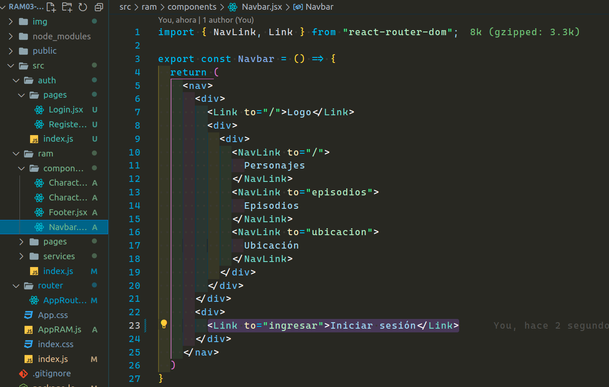

  

---

---

# `Solución homework`

---

Bueno, comenzaremos a realizar la tarea que teníamos pendiente. En primer lugar nos pedía realizar un componente `NotFound.jsx` para los casos que nuestro enrutador no haga match con nuestras rutas.

Crearé este componente en mi directorio `pages` de `ram`.

Lo siguiente que nos podía era exportar este componente en nuestro archivo de barril.

Luego nos pedía crear nuestra ruta, de la cual su path iba a ser /\*, que indicaría que todo lo que venga después de nuestra barra, y no haga match con ninguna de nuestra rutas, nos llevaría a nuestro componente `NotFound.jsx` recién creado.

El siguiente paso era crear un directorio `pages` dentro de nuestro directorio `auth`, que este mismo contendría nuestras dos páginas, una de login y otra de registro.

El quinto paso era crear dentro de nuestro directorio `auth` nuestro archivo de barril y exportar tanto `login` como `register`.

En el sexto paso debíamos crear las rutas en nuestro `AppRouter.jsx`.

Y por último nos pedía en nuestro componente `Navbar`, que al dar clic en ingresar, nos dirigiera a la ruta que contenía nuestro componente `Login`.

Bueno, cambie el texto ingresar por `Iniciar sesión`. Con esto ya hemos terminado nuestra tarea. Espero lo hayan podido lograr o al menos intentado de hacer.

---

---

Los invito a intentar completar el siguiente desafío en el `"README.md"`.

[**subir al índice**](#top)
